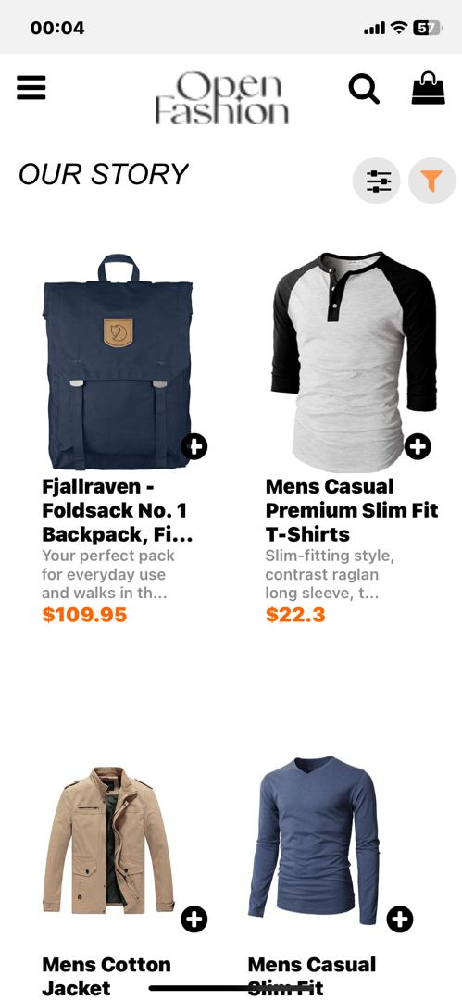
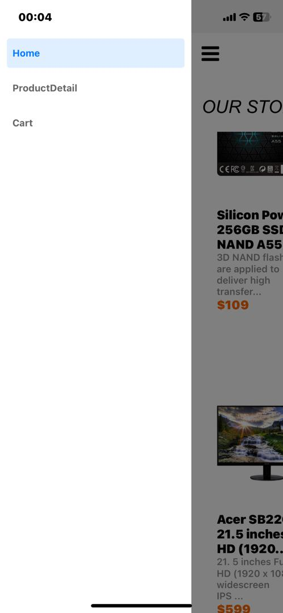
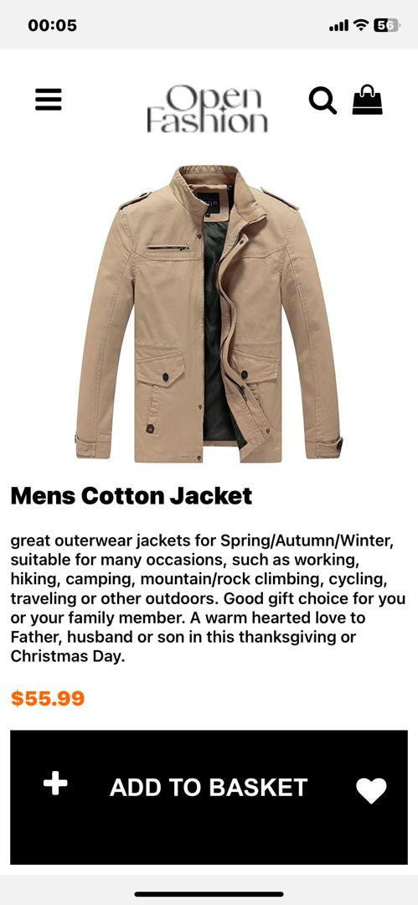
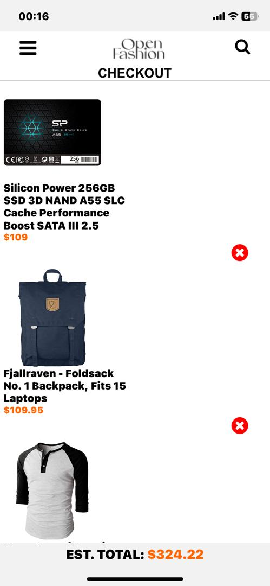

# rn-assignment7-11038553# Boutique2

Welcome to Boutique2! This is a simple e-commerce website built with React and Redux.

## Features

- Homepage
- Product details page
- Shopping cart functionality

## Screens

Here are some screenshots of the website:

## Components

The app consists of the following components:

- Header
- Footer
- Navigation
- ProductList
- ProductDetails
- ShoppingCart
- Checkout

## Installation

1. Clone the repository: `git clone https://github.com/Nana-Yaw-Oteng/rn-assignment7-11038553`
2. Navigate to the project directory: `cd Boutique2`
3. Install dependencies: `npm install`
4. Start the development server: `npm start`

## Contributing

Contributions are welcome! If you have any suggestions or find any issues, please open an issue or submit a pull request.
